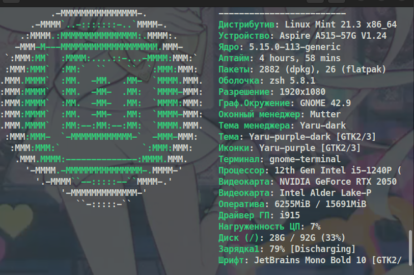

### Данный репозитории является русификатором к [neofetch](https://github.com/dylanaraps/neofetch)
 ---
 

 # Что было изменено?
 ---
 > * Были добавлены новые параметры
 > * Переведен на русский язык
 ---
### Установка:
* Устанавливаем neofetch (если у вас уже установлен пропускайте)
```bash
sudo apt install neofetch
```
* Клонируем репозитории 

```bash
git clone https://github.com/ArThirtyFour/ru_neofetch
```
* Переходим в папку 
```bash
cd ru_neofetch
```
* И меняем файлы
```bash
 sudo mv config.conf ~/.config/neofetch/config.conf
```
---
### На этом установка закончена. После изменения файла проверяем изменения через *neofetch*
### Если все переведено и работает все поставилось успешно!